# Entra PowerShell Developer Guide

The Microsoft Entra PowerShell Developer Guide helps you develop and test Entra PowerShell cmdlets. It provides information on setting up your environment, implementing cmdlets, creating and running tests, and writing cmdlet documentation.

## Table of Contents

- [Table of Contents](#table-of-contents)
- [Process-Overview](#process-overview)
- [Prerequisites](#prerequisites)
- [Environment Setup](#environment-setup)
  - [GitHub Basics](#github-basics)
- [Creating Cmdlets](#creating-cmdlets)
  - [PowerShell Cmdlet Design Guidelines](#powershell-cmdlet-design-guidelines)
  - [Design Review](#design-review)
  - [Code folders](#choose-implementation-folder)
  - [File naming convention](#file-naming-convention)
  - [Adding Get-Help content](#adding-help-content)
  - [Adding unit tests](#adding-tests)
- [After Development](#after-development)
  - [Code and doc review](#code-and-documentation-review)
  - [Publishing to PowerShell gallery](#publish-to-powershell-gallery)

## Process overview

Welcome! We're glad you're here. We're about to give you an overview of what we need to do to add cmdlets to the Entra PowerShell module. This guide aims to ensure consistency and provide a better experience for customers. Here is an overview of the process.

```mermaid
    flowchart LR
        A((Start)) --> B["Get Started #9992;
(key concepts, naming, setup)"]
         B["Get Started #9992;
(key concepts, naming, setup)"] --> C["Develop, test,
document ❴❵"]
C["Develop, test,
document ❴❵"] --> D[Review ✔]
D[Review ✔] --> E[Publish 🚀]
E[Publish 🚀] --> F(((End)))
D--changes-->C

```



| Stage          | Description                                                                                                                                                                                                                                                                                                                        |
| -------------- | ---------------------------------------------------------------------------------------------------------------------------------------------------------------------------------------------------------------------------------------------------------------------------------------------------------------------------------- |
| Get Started    | Familiarize yourself with [cmdlets][cmdlet-best-practices], modules, [parameters](./design-guidelines/parameter-best-practices.md), [piping](./design-guidelines/piping-best-practices.md) best practices, key concepts, naming conventions, testing, review processes, and other best practice guidelines. |
| Implementation | [Set up the environment](#environment-setup), [develop cmdlet logic](#creating-cmdlets), [create unit tests](#adding-tests), and [document cmdlets](#adding-help-content) with examples.                                                                                                                                                                                                                             |
| Review         | Submit changes by raising [a pull request for review](#code-and-documentation-review) by the community and the Microsoft Entra PowerShell Engineering team.                                                                                                                                                                                                          |
| Publish        | We [deploy approved changes](#publish-to-powershell-gallery) in the next release train.                                                                                                                                                                                                                                                                              |

## Prerequisites

The following prerequisites should be completed before contributing to the Entra PowerShell repository:

- Install [Visual Studio code][vscode]
- Install the latest version of [Git][git-download]
- Install the [`platyPS` module](help-generation.md#Installing-platyPS)
- Install [PSScriptAnalyzer][script-analyzer]
- Install [PowerShell 7][powershell7]
- Set the PowerShell [execution policy][set-execution-policy] to **Unrestricted** for the following versions of PowerShell:
  - `C:\Windows\System32\WindowsPowerShell\v1.0\powershell.exe`
  - `C:\Windows\SysWOW64\WindowsPowerShell\v1.0\powershell.exe`
  - `C:\Program Files\PowerShell\{{version}}\pwsh.exe`

## Environment Setup

### GitHub Basics

If you don't have experience with Git and GitHub, some of the terminology and process can be confusing. [Here is a guide to understanding the GitHub flow][git-workflow] and [here is a guide to understanding the basic Git commands][git-cheat-sheet].

To develop in the Entra PowerShell repository locally, you first need to create your own fork. For more information on how to fork, click [here][git-forking].

Once your fork of the Entra PowerShell repository has been created, you need to clone your fork to your local machine. To do so, run the following command:

```git
git clone https://github.com/<YOUR GITHUB USERNAME>/entra-powershell.git
```

You now be able to create your own branches, commit changes, and push commits to your fork.

**Note**: we recommend adding the _microsoftgraph/entra-powershell_ repository to your list of tracked repositories in Git. This allows you to easily pull changes from the `microsoftgraph/entra-powershell` repository. To do this, run the following command:

```git
git remote add upstream https://github.com/microsoftgraph/entra-powershell.git
```

Then, to pull changes from the **main** branch in _microsoftgraph/entra-powershell_ into your local working branch, run the following command:

```git
git pull upstream main
```

## Creating Cmdlets

### PowerShell Cmdlet Design Guidelines

Please check out the [_Cmdlet Best Practices_][cmdlet-best-practices] document for more information on how to create cmdlets that follow the PowerShell guidelines.

### Design Review

For a significant number of changes or additions, a design review of your proposed PowerShell cmdlets may be necessary. We recommend submitting this review through a [pull request][pull-request] with ample time for consideration. Before submitting a design review pull request, please ensure you have read the documents in the [Entra PowerShell Design Guidelines](./design-guidelines/README.md) folder.

Another scenario that might require a design review is resolving design conflicts to ensure consistency and predictability. For example, when adding business roles, it's important to clearly distinguish between Privileged Identity Management roles and catalog roles to minimize conflicts.

In the event of a persistent design conflict, the Entra PowerShell Governance Board will arbitrate and review the established guidelines. The board holds veto power, but all decisions are [documented](https://github.com/microsoftgraph/entra-powershell/discussions), including the options considered and the trade-offs involved

### Choose implementation folder

Your new cmdlet can reside in either of these folders.

| Folder name          | Description                                                                                                                                                                                                                                                                                                              |
| -------------------- | ------------------------------------------------------------------------------------------------------------------------------------------------------------------------------------------------------------------------------------------------------------------------------------------------------------------------ |
| Customizations       | For cmdlets ported from AzureAD module. See, [Beta][Beta-customizations] and [v1.0][GA-customizations] customization folders |
| Additional Functions | For new cmdlets. See, [Beta][Beta-Additional-functions] and [v1.0][GA-additional-functions] additional functions folders       |

**Note**: If unsure, choose `Additional Functions` folder.

### File naming convention

The file name should be the same as the cmdlet name.

### Adding Help Content

All cmdlets that are created must have accompanying help that is displayed when users execute the command `Get-Help <your cmdlet>`.

Each cmdlet has a markdown file that contains the help content that is displayed in PowerShell; these markdown files are created (and maintained) using the platyPS module.

For complete documentation, see [`cmdlet-reference-template`][cmdlet-reference-template] in the [`cmdlet references documentation`](./cmdlet-references-documentation/) folder. See [Beta][Beta-cmdlet-example] and [v1.0][GA-cmdlet-example] cmdlet examples.

Place cmdlet reference .md files under:

- [Beta docs](./../module/docs/entra-powershell-beta/) folder
- [v1.0 docs](./../module/docs/entra-powershell-v1.0/) folder

> _Entra PowerShell uses a single source of truth for both **Get-Help** and [public online documentation][cmdlet-references], stored in the [docs folder][docs-folder]._

### Adding Tests

All cmdlets **MUST** have unit tests. Developers are expected to write and run unit tests for their PowerShell code, ensuring that it behaves as expected and helping to prevent regressions. Entra PowerShell module use [Pester framework][pester-framework].
Place cmdlet reference .md files under:

- [Beta cmdlet tests](./../test/module/EntraBeta/) folder
- [v1.0 cmdlet tests](./../test/module/Entra/) folder

> Note:
>
> 1. Ensure your pull request has tests to verify it works as expected. Pull requests without proper tests will not be accepted.
> 1. Ensure all tests pass. The full test suite must run.

## After Development

### Code and documentation review

Once all of your cmdlets have been created and the appropriate tests have been added, you can open a pull request in the Entra PowerShell repository to have your cmdlets added to the next release. Please make sure to read [CONTRIBUTING.md](../CONTRIBUTING.md) for more information on how to open a pull request, [clean up commits](./../development-docs/design-guidelines/cleaning-up-commits.md), make sure appropriate files have been added/changed, and more.

> _Tag your pull request with **Ready For Review** label._

### Publish to PowerShell Gallery

The Entra PowerShell team will regularly publish the module, including all changes, to the [official PowerShell gallery][powershell-gallery] as outlined in our [official documentation][release-cadence].

## Crediting

Significant contributions are credited in the [misc/acknowledgements](../../entra-powershell/misc/acknowledgements) file. You might be asked to make these updates on behalf of the Entra PowerShell Engineer who accepts your pull request.

[git-cheat-sheet]: https://education.github.com/git-cheat-sheet-education.pdf
[set-execution-policy]: https://learn.microsoft.com/powershell/module/microsoft.powershell.security/set-executionpolicy
[powershell7]: https://github.com/PowerShell/PowerShell/releases/latest
[script-analyzer]: https://github.com/PowerShell/PSScriptAnalyzer#installation
[git-download]: https://git-scm.com/downloads
[vscode]: https://code.visualstudio.com/docs/setup/setup-overview
[git-workflow]: https://guides.github.com/introduction/flow/
[git-forking]: https://guides.github.com/activities/forking/
[pull-request]: https://github.com/microsoftgraph/entra-powershell/pulls
[release-cadence]: https://learn.microsoft.com/powershell/entra-powershell/entraps-versioning-release-cadence
[powershell-gallery]: https://aka.ms/EntraPSGallery
[GA-additional-functions]: https://github.com/microsoftgraph/entra-powershell/tree/main-stevemutungi-dev-docs/module/Entra/AdditionalFunctions
[Beta-Additional-functions]: https://github.com/microsoftgraph/entra-powershell/tree/main-stevemutungi-dev-docs/module/EntraBeta/AdditionalFunctions
[GA-customizations]: https://github.com/microsoftgraph/entra-powershell/tree/main-stevemutungi-dev-docs/module/Entra/customizations
[Beta-customizations]: https://github.com/microsoftgraph/entra-powershell/tree/main-stevemutungi-dev-docs/module/EntraBeta/customizations
[cmdlet-best-practices]: ./design-guidelines/cmdlet-best-practices.md
[pester-framework]: https://pester.dev
[GA-cmdlet-example]: ./cmdlet-references-documentation/cmdlet-reference-example.md
[Beta-cmdlet-example]: ./cmdlet-references-documentation/cmdlet-reference-example-beta.md
[cmdlet-reference-template]: ./cmdlet-references-documentation/cmdlet-reference-template.md
[cmdlet-references]: https://learn.microsoft.com/powershell/module/microsoft.graph.entra
[docs-folder]: https://github.com/microsoftgraph/entra-powershell/tree/main/module/docs
