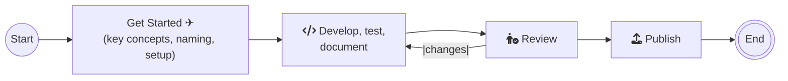

# Test

```mermaid
    flowchart LR
        A((Start)) --> B["Get Started #9992;
(key concepts, naming, setup)"]
         B["Get Started #9992;
(key concepts, naming, setup)"] --> C[fa:fa-code Develop, test,
document]
C[fa:fa-code Develop, test,
document] --> D[fa:fa-person-circle-check Review]
D[fa:fa-person-circle-check Review] --> E[fa:fa-upload Publish]
E[fa:fa-upload Publish] --> F(((End)))
D--|changes|-->C

```
