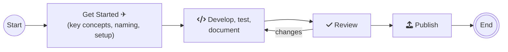

# Entra PowerShell Developer Guide

The Microsoft Entra PowerShell Developer Guide helps you develop and test Entra PowerShell cmdlets. It provides information on setting up your environment, implementing cmdlets, creating and running tests, and writing cmdlet documentation.

## Table of Contents

- [Table of Contents](#table-of-contents)
- [Process-Overview](#process-overview)
- [Prerequisites](#prerequisites)
- [Environment Setup](#environment-setup)
  - [GitHub Basics](#github-basics)
  - [Building the Environment](#building-the-environment)
  - [Generating Help](#generating-help)
  - [Running Static Analysis](#running-static-analysis)
  - [Running Tests](#running-tests)
- [Before Adding a New Project](#before-adding-a-new-project)
  - [.NET SDK](#net-sdk)
  - [Design Review](#design-review)
  - [Point of Contact](#point-of-contact)
- [Setting Up a New Project](#setting-up-a-new-project)
  - [Getting Started](#getting-started)
    - [Creating the Project](#creating-the-project)
    - [Adding Project References](#adding-project-references)
- [Creating Cmdlets](#creating-cmdlets)
  - [PowerShell Cmdlet Design Guidelines](#powershell-cmdlet-design-guidelines)
  - [Exceptions Guidelines](#exceptions-guidelines)
  - [Enable Running PowerShell when Debugging](#enable-running-powershell-when-debugging)
    - [Set a StartUp Project](#set-a-startup-project)
    - [Setup a Debug Profile](#setup-a-debug-profile)
  - [Adding Help Content](#adding-help-content)
- [Adding Tests](#adding-tests)
  - [Using Azure TestFramework](#using-azure-testframework)
  - [Scenario Tests](#scenario-tests)
    - [Adding Test Project](#adding-test-project)
    - [Adding Scenario Tests](#adding-scenario-tests)
    - [Use local files in test](#use-local-files-in-test)
    - [Using Active Directory](#using-active-directory)
    - [AD Scenario Tests](#ad-scenario-tests)
    - [Recording/Running Tests](#recordingrunning-tests)
- [After Development](#after-development)
  - [Change Log](#change-log)
- [Misc](#misc)
  - [Publish to PowerShell Gallery](#publish-to-powershell-gallery)
- [AutoRest PowerShell Generator](#autorest-powershell-generator)

## Process overview

Welcome! We're glad you're here. We're about to give you an overview of what we need to do to add cmdlets to the Entra PowerShell module. This guide aims to ensure consistency and provide a better experience for customers. Here is an overview of the process.



| Stage          | Description                                                                                                                                                                     |
| -------------- | ------------------------------------------------------------------------------------------------------------------------------------------------------------------------------- |
| Get Started    | Familiarize yourself with cmdlets, modules, parameters, piping best practices, key concepts, naming conventions, testing, review processes, and other best practice guidelines. |
| Implementation | Set up the environment, develop cmdlet logic, create unit tests, and document cmdlets with examples.                                                                            |
| Review         | Submit changes by raising a pull request for review by the community and the Microsoft Entra PowerShell Engineering team.                                                       |
| Publish        | We deploy approved changes in the next release train.                                                                                                                           |

## Prerequisites

The following prerequisites should be completed before contributing to the Entra PowerShell repository:

- Install [Visual Studio code][vscode]
- Install the latest version of [Git][git-download]
- Install the [`platyPS` module](help-generation.md#Installing-platyPS)
- Install [PSScriptAnalyzer][script-analyzer]
- Install [PowerShell 7][powershell7]
- Set the PowerShell [execution policy][set-execution-policy] to **Unrestricted** for the following versions of PowerShell:
  - `C:\Windows\System32\WindowsPowerShell\v1.0\powershell.exe`
  - `C:\Windows\SysWOW64\WindowsPowerShell\v1.0\powershell.exe`
  - `C:\Program Files\PowerShell\{{version}}\pwsh.exe`

## Environment Setup

### GitHub Basics

If you don't have experience with Git and GitHub, some of the terminology and process can be confusing. [Here is a guide to understanding the GitHub flow][git-workflow] and [here is a guide to understanding the basic Git commands][git-cheat-sheet].

To develop in the Entra PowerShell repository locally, you first need to create your own fork. For more information on how to fork, click [here][git-forking].

Once your fork of the Entra PowerShell repository has been created, you need to clone your fork to your local machine. To do so, run the following command:

```
git clone https://github.com/<YOUR GITHUB USERNAME>/entra-powershell.git
```

You now be able to create your own branches, commit changes, and push commits to your fork.

**Note**: we recommend adding the _microsoftgraph/entra-powershell_ repository to your list of tracked repositories in Git. This allows you to easily pull changes from the `microsoftgraph/entra-powershell` repository. To do this, run the following command:

```
git remote add upstream https://github.com/microsoftgraph/entra-powershell.git
```

Then, to pull changes from the **main** branch in _microsoftgraph/entra-powershell_ into your local working branch, run the following command:

```
git pull upstream main
```

## Creating Cmdlets

### PowerShell Cmdlet Design Guidelines

Please check out the [_Cmdlet Best Practices_](./design-guidelines/cmdlet-best-practices.md) document for more information on how to create cmdlets that follow the PowerShell guidelines.

[git-cheat-sheet]: https://education.github.com/git-cheat-sheet-education.pdf
[set-execution-policy]: https://learn.microsoft.com/powershell/module/microsoft.powershell.security/set-executionpolicy
[powershell7]: https://github.com/PowerShell/PowerShell/releases/latest
[script-analyzer]: https://github.com/PowerShell/PSScriptAnalyzer#installation
[git-download]: https://git-scm.com/downloads
[vscode]: https://code.visualstudio.com/docs/setup/setup-overview
[git-workflow]: https://guides.github.com/introduction/flow/
[git-forking]: https://guides.github.com/activities/forking/
